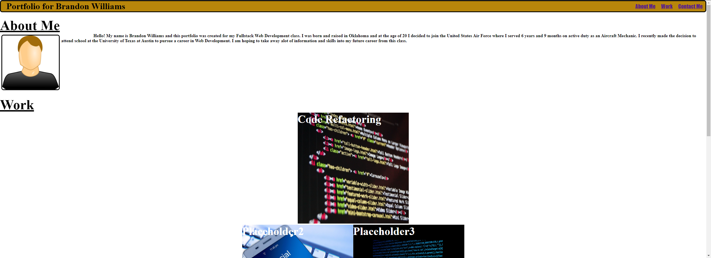

# Brandon's Portfolio Project

## I have to start out with saying that assignment was pretty hard for me to complete without assisstance from a TA. We had to start from scatch with no code given so I had to make the .HTML and .CSS files from scratch with nothing provided, it really tested my skills and knowledge from previous class meetings. My main motivation is mainly wanting to learn how to become a web developer so I can have a more enjoyable career. For this project I built a personal portfolio that consisted of an 'About Me' section where I gave a small introduction about myself, a 'Work' section where I was able to showcase previous work, although all the pictures linked go to our module 1 challenge Horiseon webpage I was able to demonstrate that I learned how to set an image as a link to a certain webpage or application.

# Deployed Webpage

# Picture Accredidations
## https://pixabay.com/vectors/user-man-profile-male-face-gui-33638/
## https://cyberpro-israel.co.il/technologies/cyberzone/
## https://pixabay.com/photos/mobile-phone-smartphone-keyboard-1917737/
## https://pixabay.com/photos/program-programming-keyboard-3460032/
## https://pixabay.com/photos/technology-startup-business-798619/ 